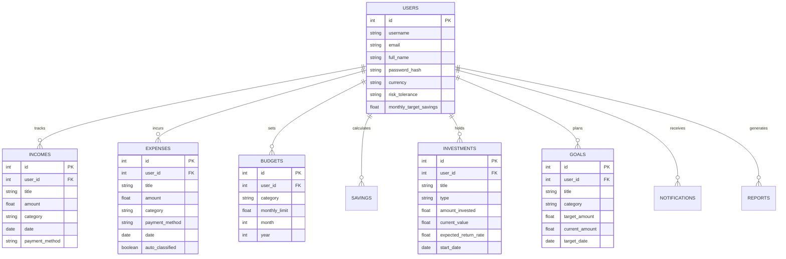

# 🚀 Personal Financial Management System (PFM Pro)

A production-ready, industry-level FinTech Personal Financial Management System built with **Python 3.13, Flask, SQLAlchemy, Pandas, NumPy, Scikit-Learn, and ReportLab**.

Inspired by modern wealth management applications like **Groww, INDmoney, Walnut, and CRED**, PFM Pro provides complete transaction tracking, automated savings math, AI spending prediction, smart budget recommendation, investment portfolio management, financial goal tracking, health scoring, and downloadable PDF reports.

---

## 🌟 Core Features

- **User Authentication & Security**: Password hashing (`Werkzeug`), session persistence (`Flask-Login`), CSRF protection (`Flask-WTF`).
- **Financial Command Center**: Real-time KPI cards, time-period matrix (Weekly, Monthly, Quarterly, Yearly), Chart.js graphs, dynamic health score.
- **Income Management**: Track income streams across 8 categories (Salary, Business, Freelancing, Bonus, Gift, Investment Returns, Rental Income, Others).
- **Expense Management**: Multi-category expense tracking with payment methods (Cash, UPI, Credit Card, Debit Card, Net Banking) and pre-defined time filters.
- **AI Auto-Classifier**: Automatic merchant description tagger (Swiggy -> Food, Uber -> Travel, Amazon -> Shopping, Apollo -> Medical, BookMyShow -> Entertainment).
- **Monthly Budget Planner**: Set category limits, real-time percentage used progress bars, and overflow warnings.
- **Automated Savings Engine**: Formula-driven savings calculation ($\text{Savings} = \text{Income} - \text{Expenses}$), savings rate, and period comparisons.
- **AI Spending Predictor**: Scikit-Learn Ridge/Linear Regression time-series model forecasting Next Week, Next Month, and Next Quarter spending.
- **AI Smart Budget Recommendation**: 50/30/20 financial rule allocator combined with historical spending habits.
- **Wealth & Investment Planner**: Track portfolio (Mutual Funds, Stocks, Gold, PPF, FD, RD, NPS, Bonds), Emergency Fund checker, Passive Income estimator, compound wealth calculator.
- **Financial Goal Planner**: Goal target deadlines, required monthly contribution math, deposit tracking.
- **Financial Health Score**: Dynamic 0–100 score engine analyzing 6 financial pillars (Savings Rate, Budget Usage, Investment Ratio, Emergency Fund, Goal Progress, Spending Stability).
- **PDF & Data Exports**: Professional downloadable PDF financial statements via ReportLab, alongside CSV and Excel (`.xlsx`) datasets.

---

## 🛠️ Technology Stack

- **Backend**: Python 3.13, Flask, SQLAlchemy ORM, SQLite
- **AI & Analytics**: Pandas, NumPy, Scikit-Learn (LinearRegression / Ridge)
- **Reporting Engine**: ReportLab, OpenPyXL
- **Security**: Flask-Login, Flask-WTF CSRFProtect, Werkzeug Security
- **Frontend**: HTML5, CSS3 (Glassmorphism Dark Navy `#0F172A`), Bootstrap 5, Font Awesome 6, Chart.js 4.x, Google Font Poppins

---

## 📂 Project Architecture

```
DA codegnan/
├── app/
│   ├── models/           # SQLAlchemy Data Models (User, Income, Expense, Budget, Savings, Investment, Goal, Notification, Report)
│   ├── routes/           # Flask Blueprints (auth, dashboard, income, expense, budget, investment, goal, ai, reports)
│   ├── services/         # Core Services (ai_predictor, ai_classifier, smart_budget, health_score, pdf_generator, exporter, notification_service)
│   ├── static/           # Custom Glassmorphism CSS & JavaScript
│   ├── templates/        # Jinja HTML Templates & UI Components
│   └── reports/          # Storage for Generated PDF Reports
├── instance/             # SQLite Database (fintech_pfm.db)
├── config.py             # App Configuration Settings
├── requirements.txt      # Python Package Dependencies
├── run.py                # Application Entry Point
└── seed.py               # Database Demo Data Seeder
```

---

## 🚦 Installation & Quick Start Guide

### 1. Prerequisites
Ensure **Python 3.13** or higher is installed on your system.

### 2. Install Dependencies
```bash
pip install -r requirements.txt
```

### 3. Seed Demo Data
Populate the database with realistic sample transactions, budgets, investments, and goals:
```bash
python seed.py
```

### 4. Run the Application
```bash
python run.py
```
Open your browser and navigate to: `http://127.0.0.1:5000`

### 🔑 Demo Login Credentials
- **Username**: `demouser`
- **Password**: `demo123`

---

## 📊 Database Schema (ER Diagram)


